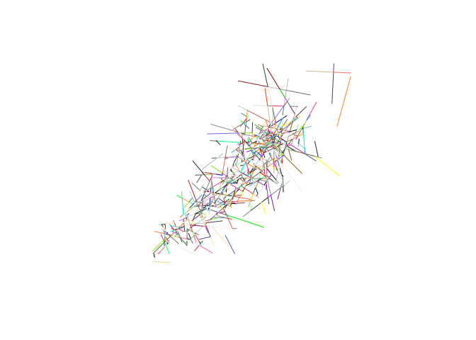
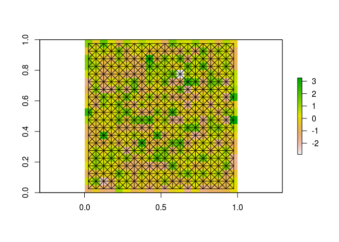
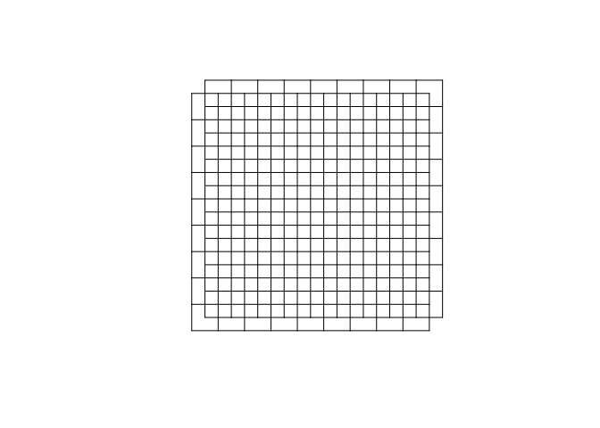
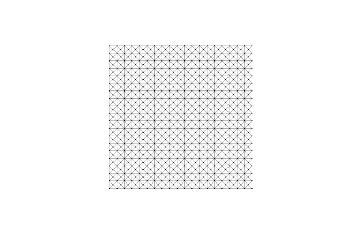

BoostLines package
================
Philipp Hunziker
October 19, 2017

Fast geometric operations on lines using [Boost Geometries](http://www.boost.org/doc/libs/1_65_1/libs/geometry/doc/html/index.html); primarily for work on planar networks.

<span style="color:red">CAUTION</span>: This package is in development - its interface may change.

Installation
------------

You can install the package directly from this repository:

``` r
library(devtools)
install_github("hunzikp/BoostLines")
```

Usage
-----

### Overview

-   [Cast as/from `SpatialLines`](#cast-to-and-from-spatiallines-objects)
-   [Noding](#noding)
-   [Intersection](#intersection)
-   [Minimal distance](#minimal-distance)
-   [Create line grid](#create-line-grid)
-   [Concatenate](#concatenate-two-or-more-boostline-objects)
-   [Elminiate multilines](#elminiate-multilines-in-spatiallines-objects)
-   [Line lengths](#calculate-line-lengths)
-   [Cast as `igraph`](#cast-as-igraph-object)

### Cast to and from `SpatialLines` objects

``` r
library(BoostLines)
library(sp)

## Make some lines
set.seed(0)
N <- 250
lines.ls <- vector('list', N)
for (i in 1:N) {
  strt <- runif(1)
  range <- runif(1)
  coords <- matrix(runif(4, strt, strt+range), 2, 2)
  lines.ls[[i]] <- Lines(slinelist = list(Line(coords = coords)), ID = i)
}
test.sl <- SpatialLines(lines.ls)

## Make BoostLines object
test.bl <- BoostLines(test.sl)

## Cast back to SpatialLines
test_cast.sl <- unboost(test.bl) 
```

### Noding

``` r
## Node
out.ls <- bNode(test.bl)

## Unpack & plot result
noded.sl <- unboost(out.ls[[1]])
noded.ids <- out.ls[[2]]  # integer vector of original IDs
plot(noded.sl, col=sample(colors(), length(noded.sl), replace=TRUE))
```



### Intersection

``` r
## Intersect query
lmat <- bIntersects(test.bl)

## Compare with gIntersects
suppressMessages(library(rgeos))
lmat_geos <- gIntersects(test.sl, byid=TRUE)
all(lmat == lmat_geos)
```

    ## [1] TRUE

### Minimal distance

``` r
## Calc Distances
dmat <- bDistance(test.bl)

## Compare with gDistance
dmat_geos <- gDistance(test.sl, byid=TRUE)
summary(abs(as.vector(dmat - dmat_geos)))
```

    ##      Min.   1st Qu.    Median      Mean   3rd Qu.      Max. 
    ## 0.000e+00 1.102e-09 2.617e-09 3.023e-09 4.536e-09 1.310e-08

### Create line grid

``` r
## Create a RasterLayer
library(raster)
set.seed(0)
ras <- raster(matrix(rnorm(20^2), 20, 20))

## Create a gridded, 8-connected BoostLines object
grid.bl <- bGrid(ras, n8 = TRUE)

## Plot raster & gridded lines
grid.sl <- unboost(grid.bl)
plot(ras)
plot(grid.sl, add=TRUE)
```



### Concatenate two or more BoostLine objects

``` r
## Create two BoostLine Objects
grid1.bl <- bGrid(x = c(0,0), nrow = 10, ncol = 10, res = 1, n8 = FALSE)
grid2.bl <- bGrid(x = c(0.5,0.5), nrow = 10, ncol = 10, res = 1, n8 = FALSE)

## Concatenate
app.bl <- bAppend(list(grid1.bl, grid2.bl))

## Plot joint BoostLine object
app.sl <- unboost(app.bl)
plot(app.sl)
```



Note: `bAppend` does not node lines. For noding, use `bNode`.

### Elminiate multilines in SpatialLines\* objects

The `BoostLines` function only accepts `SpatialLine*` objects without multilines. I.e. each feature must be a simple line string. The `remove_multilines` function removes multiline features in `SpatialLine*` objects and replaces them with simple lines.

``` r
## Create a SpatialLines object containing a multiline
set.seed(0)
eLine1 <- Line(matrix(rnorm(4), 2, 2))
eLine2 <- Line(matrix(rnorm(4), 2, 2))
eLines <- Lines(slinelist = list(eLine1, eLine2), '1')
sl <- SpatialLines(list(eLines))

## Try to cast as BoostLines object
library(testthat)
expect_error(BoostLines(sl))

## Remove Multilines
sl2 <- remove_multilines(sl)

## Try again
bl <- BoostLines(sl2)
```

### Calculate line lengths

``` r
## Create a BoostLines object
ras <- raster(matrix(rnorm(20^2), 20, 20))
bl <- bGrid(ras)

## Calculate lengths
lengths <- bLength(bl, lonlat = FALSE) ## If lonlat=TRUE, lengths are returned in meters
summary(lengths)
```

    ##    Min. 1st Qu.  Median    Mean 3rd Qu.    Max. 
    ## 0.03536 0.03536 0.03536 0.04041 0.05000 0.05000

### Cast as `igraph` object

``` r
## Create a BoostLines object
ras <- raster(matrix(rnorm(20^2), 20, 20))
bl <- bGrid(ras)

## Cast as igraph object
df <- data.frame(edge_id = 1:length(bl))
suppressMessages(library(igraph))
gr <- boost2graph(x = bl, df = df, lonlat = FALSE, plot.result = TRUE)
```



``` r
## Explore vertex and edge attributes
print(vertex_attr_names(gr))
```

    ## [1] "name" "x"    "y"

``` r
print(edge_attr_names(gr))
```

    ## [1] "order"   "edge_id" "length"

### Split lines

``` r
## Split
out.ls <- bSplit(test.bl, maxlen = 0.05)

## Summary of line lengths
split.bl <- out.ls[[1]]
split.ids <- out.ls[[2]]  # integer vector of original IDs
summary(bLength(split.bl, lonlat = FALSE))
```

    ##      Min.   1st Qu.    Median      Mean   3rd Qu.      Max. 
    ## 2.386e-05 5.000e-02 5.000e-02 4.523e-02 5.000e-02 5.000e-02
